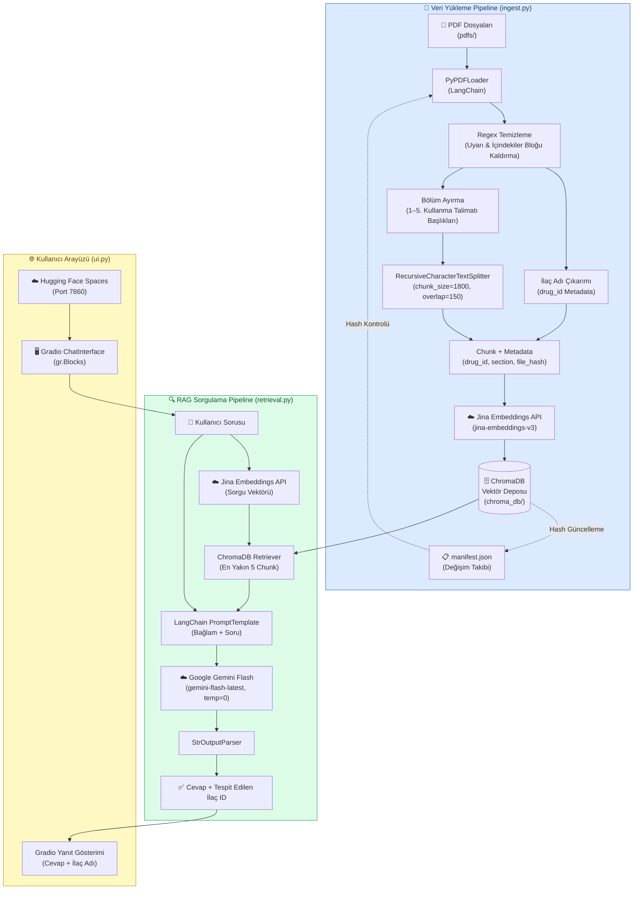

# Huggingface Space : [emrecn/ilacChatBot](https://huggingface.co/spaces/emrecn/ilacChatBot)

# ilacChat

Turkce ilac kullanma talimatlarindan bilgi alan, PDF tabanli bir RAG sohbet uygulamasidir.
Uygulama, prospektusleri okuyup vektor veritabanina kaydeder; kullanici sorularini bu bilgi tabanina gore yanitlar.

## ÖNEMLİ !! Doküman olarak kullandığım pdflerin ait olduğu ilaçların adları drug_list.text belgesinin içerisinde yazmaktadır. Model sadece bu ilaçlarla ilgili cevap verebilir.

## Mimari Diyagramı



## Özellikler

- PDF kullanma talimatlarindan otomatik veri cekme
- Regex tabanli metin temizleme ve bolum ayirma
- ChromaDB ile vektor arama
- Google Gemini ile yanit olusturma
- Jina Embeddings ile semantik temsil
- Gradio tabanli web arayuzu
- Hafizasiz, tek soruluk RAG akisi

## Kullanılan Teknolojiler

- Python
- LangChain
- ChromaDB
- Gradio
- Google Gemini API
- Jina Embeddings
- PyPDF
- Hugging Face Spaces

## Proje Yapisi

```text
.
├── app.py
├── app/
│   ├── __init__.py
│   ├── ingest.py
│   ├── retrieval.py
│   └── ui.py
├── chroma_db/
├── pdfs/
├── requirements.txt
├── manifest.json
└── drugs_list.txt
```

## Yerel Kurulum

1. Sanal ortam olusturun ve bagimliliklari yukleyin.

```bash
python -m venv venv
.\venv\Scripts\activate
pip install -r requirements.txt
```

2. Koku dizinde `.env` dosyasi olusturun ve API anahtarlarini ekleyin.

```ini
GOOGLE_API_KEY=your_gemini_key
JINA_API_KEY=your_jina_key
```

3. PDF dosyalarinizi `pdfs/` klasorune koyun ve vektor veritabanini olusturun.

```bash
python -m app.ingest --pdf-dir ./pdfs --mode full
```

4. Uygulamayi calistirin.

```bash
python app.py
```


## Geliştirilecek Özellikler

- Daha iyi bolum tespiti ve chunk kalitesi
- Benzer ilaclar icin akilli eslestirme ve yeniden sorgulama
- Kaynak gosterimini daha okunabilir hale getirme
- Soru-cevap gecmisini opsiyonel hale getirme
- PDF disinda ilac kutu bilgileri ve prospektus metadata destegi
- Kullanici arayuzu icin daha gelismis filtreleme ve sonuc ozetleri
- Toplu PDF yukleme ve otomatik yeniden indeksleme
- Hata izleme ve log kaydi iyilestirmeleri

